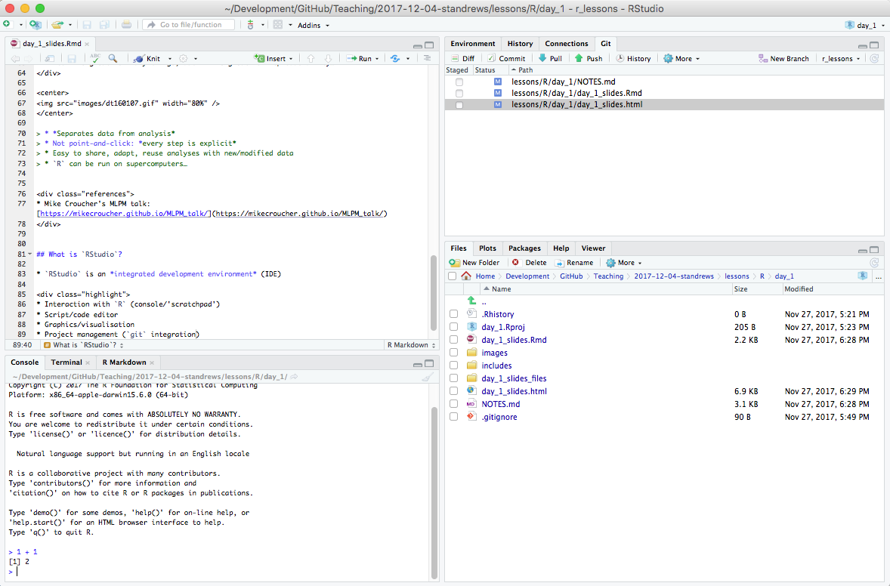
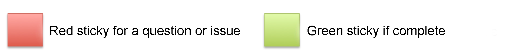

```{r setup, include=FALSE}
knitr::opts_chunk$set(echo = TRUE)
```

## Etherpad

<div class="attention">
Please do take notes on the course `etherpad`:
</div>

[http://pad.software-carpentry.org/2018-09-05-dundee](http://pad.software-carpentry.org/2018-09-05-dundee)

<div class="highlight">
- **Communal notes**: share your understanding, and benefit from others
- **Ask questions**: get detailed answers with links and examples
- **A record/reference for after the course**
</div>


## Learning Objectives

- Fundamentals of `RStudio` (refresher)
- `RStudio` project creation and version control (refresher)
- Flow control in `R` (refresher)
- Functions in `R` (refresher)
- Literate programming with `RMarkdown` and `knitr`
- Good practice for programming and project management

<div class="attention">
**We're assuming some familiarity with:**

- `R` syntax, data types and structures (especially `data.frame`s)
- variables and variable assignment (`<-`)
- using `R` packages
- `R` base graphics/`ggplot2`
</div>

<!-- SECTION 01: `RStudio` -->

# SECTION 01: `RStudio`

## Learning Objectives

- The elements of an `RStudio` session
  - interactive code
  - writing scripts/documents
  - live view of graphical output
  - getting help
  - interaction with the filesystem
  - project and environment management


## What is `RStudio`?

* `RStudio` is an *integrated development environment* (IDE) - all platforms

<center>


</center>

<div class="highlight">
- Interaction with `R` (console/'scratchpad')
- Script/code editor
- Graphics/visualisation
- Project management (`git` integration)
</div>

## `RStudio` overview - Interactive Demo

<center>

</center>

<center>
<div class="attention">
**INTERACTIVE DEMO**
</div>
</center>




## Built-in Functions

- Function (`log()`, `sin()` etc.) ≈ "canned script"
  - automate complicated tasks
  - make code more readable and reusable
- Some functions are built-in (in *base* packages, e.g. `sqrt()`, `lm()`, `plot()`)
- Some functions are *imported* from *libraries*

<div class="highlight">
- Functions usually take *arguments* (*input*)
- Functions often *return* values (*output*)
</div>

<center>
<div class="attention">
INTERACTIVE DEMO
</div>
</center>


## Getting Help For Built-in Functions

<center>
<div class="attention">
INTERACTIVE DEMO
</div>
</center>

```{r, eval=FALSE}
?fname                 # help page for fname
help(fname)            # help page for fname
??fname                # any mention of fname
args(fname)            # arguments for fname
vignette(fname)        # worked examples for fname
vignette()             # show all available vignettes
help.search("text")    # any mention of "text"
```


## Numerical comparisons

- Computers can have limits to numeric precision
  - (they do what you tell them, not necessarily what you want)

<center>
<div class="attention">
INTERACTIVE DEMO
</div>
</center>
  
```{r, eval=FALSE}
> pi - 1e-8 == pi
[1] FALSE
> all.equal(pi - 1e-8, pi)
[1] TRUE
```

```{r, eval=FALSE}
> log(0.01 ^ 200)
[1] -Inf
> 200 * log(0.01)
[1] -921.034
```


## Working in `RStudio`

<div class="highlight">
We can write code in several ways in `RStudio`
</div>

* At the console (you've done this)
* In a script
* As an interactive notebook or markdown file
* As a Shiny app

We're going to create a new dataset and `R` script.

* Putting code in a script makes it easier to modify, share and run

<center>
<div class="attention">
**INTERACTIVE DEMO**
</div>
</center>


<!-- SECTION 02: My First `RStudio` Project -->

# SECTION 02: <br />My First `RStudio` Project

## Learning Objectives

- Load data into an `R` project
- Produce summary statistics of data
- Extract subsets of data
- Plotting in `R`
